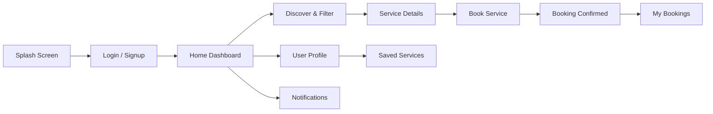

# NearServe – Local Service Booking Mobile App

NearServe is a full-stack, local service booking mobile application built with **React Native (Expo + TypeScript)** for the frontend, **Node.js & Express.js** for the REST API backend, and **MySQL** for relational persistence.

> **Tagline:** “Your Local Services, Just a Tap Away.”

---

## 📱 Application Flow & Features



---

## 🎨 Design System & Theme

| Property | Value | Purpose |
| :--- | :--- | :--- |
| **Primary** | `#5B4BDB` | Core brand color, primary CTA buttons, active tab indicators |
| **Secondary** | `#7C6CE8` | Medium purple accents, badges & highlights |
| **Background** | `#F8F9FC` | Soft off-white screen background |
| **Card Surface** | `#FFFFFF` | Elevated cards, forms, and modals |
| **Text Primary** | `#1F2937` | High-contrast Charcoal/Slate titles and body |
| **Text Secondary** | `#6B7280` | Muted cool gray captions and subtitles |
| **Success** | `#22C55E` / `#10B981` | Confirmed tags and verified pros |
| **Warning** | `#F59E0B` | Pending / in-progress status |
| **Danger / Error** | `#EF4444` | Form errors, cancelled status, logout |

---

## 📱 Complete Screens Breakdown

1. **Splash Screen (`src/screens/SplashScreen.tsx`)**
   - Brand logo with elevated glowing outer ring and sparkle badge.
   - Tagline: *“Your Local Services, Just a Tap Away.”*
   - Feature highlight chips (*Verified Pros*, *Instant Booking*, *Top Rated*).
   - Smooth entrance animations and automatic 2.4s transition to **Login**.

2. **Login Screen (`src/screens/LoginScreen.tsx`)**
   - Email/Phone input with validation and password visibility toggle.
   - "Forgot Password?" dialog and link to **Signup Screen**.
   - **Quick Demo Login** button (`demo@nearserve.com` / `password123`).

3. **Signup Screen (`src/screens/SignupScreen.tsx`)**
   - Full Name, Email, Phone Number, Location / Area, Password, and Confirm Password.
   - Full field format validation and account creation.

4. **Home Screen (`src/screens/HomeScreen.tsx`)**
   - User greeting (`Hello, [User Name]! 👋`), location selector (`📍 Coimbatore`).
   - Notification bell with unread badge indicator, profile avatar shortcut.
   - Large search bar (*"What service do you need?"*).
   - Horizontally scrollable **10 Categories** (Plumbing, Electrical, Cleaning, AC Repair, Appliance Repair, Beauty & Salon, Painting, Vehicle Service, Gardening, Computer Repair).
   - **Nearby Services** section with "See All" and rich provider cards (starting prices in ₹, rating, distance, heart favorite `♡ → ♥`, and "View Details").

5. **Discover Screen (`src/screens/DiscoverScreen.tsx`)**
   - Live search by service name, provider name, or category keywords.
   - **Filter Modal (Bottom Sheet)**:
     - Categories: All + 10 specific categories
     - Distance: 1 km, 3 km, 5 km, 10 km
     - Price Range: Min & Max price inputs (e.g. ₹100 – ₹2000)
     - Rating: 4.5★+, 4★+, 3★+, Any
     - Availability: Available Now, Today, Tomorrow
     - Sort Options: Relevance, Distance, Rating, Price: Low to High, Price: High to Low
   - Active filter pills with one-tap removal and "No services found" empty state.

6. **Service Details Screen (`src/screens/ServiceDetailsScreen.tsx`)**
   - Large hero image with floating back button and favorite heart toggle.
   - Service name, provider name, rating, reviews count, distance, starting price.
   - Services offered package list with duration and price breakdown.
   - Location / Service area coverage and phone call trigger.
   - Customer Reviews section with authentic sample feedback.
   - Sticky footer: **Book Now** button.

7. **Booking Screen (`src/screens/BookingScreen.tsx`)**
   - Summary card of selected service, provider, and price.
   - **Date Selector**: Horizontal 7-day calendar picker (Today, Tomorrow, +5 upcoming days).
   - **Time Slot Selector**: Time pills (`09:00 AM`, `10:00 AM`, `11:00 AM`, `02:00 PM`, `04:00 PM`, `06:00 PM`).
   - **Service Location**: Address, Area (e.g. `Gandhipuram`), City (`Coimbatore`), Pincode (`641012`).
   - **Additional Instructions**: Landmark / issue notes text box.
   - **Price Summary**: Service Charge (`₹499`), Additional Charges (`₹0`), Total (`₹499`).
   - **Confirm Booking** button with input validation.

8. **Booking Confirmation Screen (`src/screens/BookingConfirmationScreen.tsx`)**
   - `Booking Confirmed! ✓` celebratory badge.
   - Unique Booking ID (e.g. `#NS20260922001`).
   - Scheduled date, time, location, price, and initial status (`Pending`).
   - **View Booking** & **Back to Home** buttons.

9. **My Bookings Screen (`src/screens/MyBookingsScreen.tsx`)**
   - 3 Tabs: **Upcoming** (Pending, Confirmed, In Progress) | **Completed** | **Cancelled**.
   - Booking cards with status badges, price, and "View Details".

10. **Booking Details Screen (`src/screens/BookingDetailsScreen.tsx`)**
    - Visual status progress timeline (`Booking Placed → Confirmed → Provider Assigned → Service Started → Completed`).
    - Full address, provider info with direct call button, price summary.
    - **Cancel Booking** button with confirmation modal (*"Are you sure you want to cancel this booking?"*).
    - **Rate Service** interactive 5-star rating modal with comment input for completed bookings.

11. **Profile Screen (`src/screens/ProfileScreen.tsx`)**
    - Avatar, user name, email, phone, location.
    - Quick stats (Bookings count, Saved count, Notifications count).
    - **Edit Profile** modal (Name, Email, Phone, Location).
    - Shortcuts to **Saved Services**, **Notifications**, **Help & Support**, **Terms & Conditions**, **Privacy Policy**, and **Logout**.

12. **Saved Services Screen (`src/screens/SavedServicesScreen.tsx`)**
    - List of bookmarked/favorite service providers with instant navigation to service details.

13. **Notifications Screen (`src/screens/NotificationsScreen.tsx`)**
    - Timestamped updates on booking confirmations, technician assignment, reminders, and cancellations.
    - Visual read/unread indicators.

---

## 🗄️ Backend & Database Architecture

### Directory Structure
```
nearserve/
├── App.tsx
├── package.json
├── src/
│   ├── constants/
│   ├── context/
│   ├── data/
│   ├── navigation/
│   ├── screens/
│   ├── services/
│   │   └── api.ts             # Centralized API service layer with mock fallback
│   └── types/
└── backend/
    ├── config/
    │   └── db.js              # MySQL connection pool
    ├── controllers/
    │   ├── authController.js
    │   ├── serviceController.js
    │   ├── bookingController.js
    │   ├── notificationController.js
    │   └── reviewController.js
    ├── database/
    │   ├── schema.sql         # 8 MySQL DDL tables
    │   ├── seed.sql           # Initial seed data
    │   └── initDb.js          # DB setup runner
    ├── middleware/
    │   └── auth.js            # JWT verification middleware
    ├── routes/
    │   └── api.js             # REST API router
    ├── server.js              # Express app entry point
    └── .env                   # Environment variables
```

### MySQL Tables (8 Tables)
1. `users` (id, name, email, phone, password, location, created_at)
2. `service_categories` (id, name, description)
3. `service_providers` (id, name, phone, email, category_id, location, rating, total_reviews, starting_price, description, availability, image_url)
4. `services` (id, provider_id, category_id, service_name, description, price, duration, location, rating)
5. `bookings` (id, booking_id, user_id, service_id, provider_id, booking_date, booking_time, service_location, notes, price, status, created_at)
6. `reviews` (id, user_id, service_id, rating, comment, created_at)
7. `notifications` (id, user_id, title, message, is_read, created_at)
8. `saved_services` (id, user_id, service_id, created_at)

---

## 🚀 How to Run the Application

### 1. Launch Frontend (Expo Mobile App)
- **In Web Browser (1-Click):**
  ```powershell
  .\web.bat
  ```
- **On Phone via Expo Go (1-Click):**
  ```powershell
  .\start.bat
  ```

### 2. Launch Backend (Express.js REST API)
```bash
cd backend
npm install
npm start
```
*Backend runs on `http://localhost:5000` with REST APIs mounted at `/api`.*

### 3. Initialize MySQL Database (Optional)
Ensure MySQL service is running on port 3306, then execute:
```bash
cd backend
npm run db:init
```

---

## 🧪 How to Run Automated Tests

To run the complete 29-phase validation test suite:
```bash
npm test
```
To verify TypeScript compilation:
```bash
npm run check-types
```

---

## 🔑 Demo Login Credentials
- **Email:** `demo@nearserve.com`
- **Password:** `password123`
*(Or click the "⚡ Quick Demo Login" button on the Login screen for instant one-tap access)*
